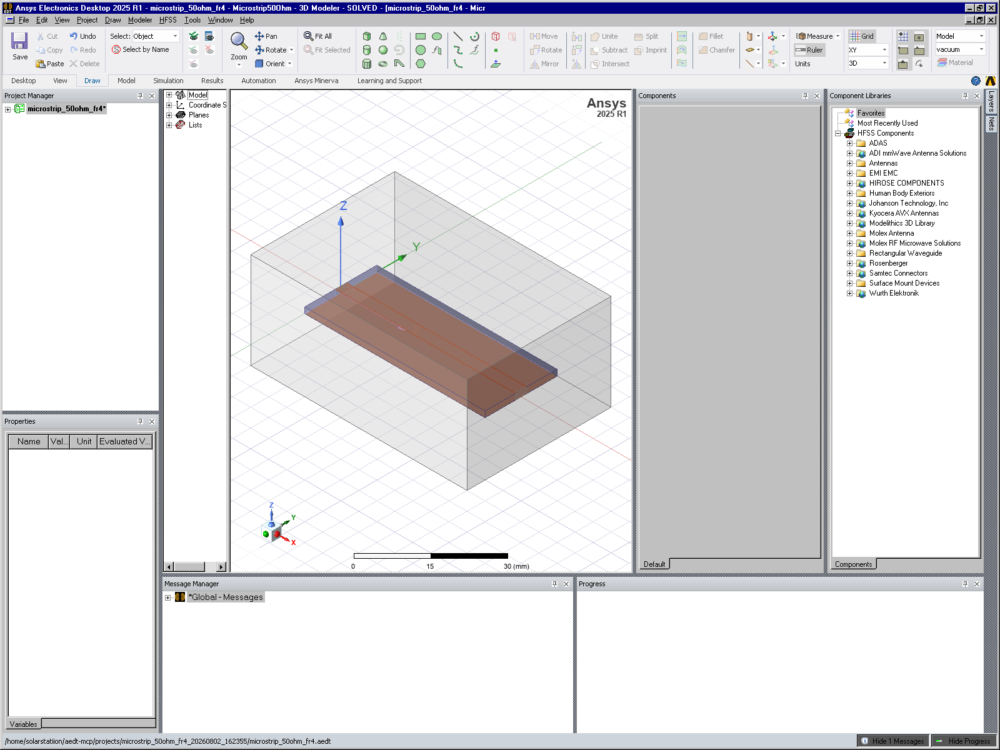
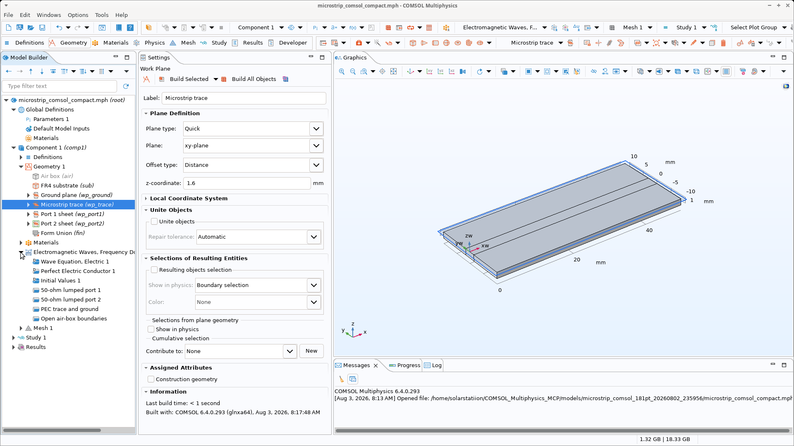

# LLM-controlled HFSS and COMSOL microstrip simulations

This repository contains reproducible Ansys HFSS 2025 R1 and COMSOL
Multiphysics 6.4 models of the same nominal 50-ohm FR-4 microstrip line.
Both models were generated and solved programmatically through Python/MCP
workflows, with 181 S-parameter points from 1 to 10 GHz.

## Dr Strange Engine

The [Dr Strange Engine](dr-strange-engine/README.md) is the human-guided tuning
framework built from this experiment. It presents alternative structural
optimization branches, explains expected responses and trade-offs, preserves
global guardrails, and requires the engineer to choose every simulation path.

- [Framework and Q&A protocol](dr-strange-engine/README.md)
- [Machine-readable tuning-session schema](dr-strange-engine/schemas/tuning-session.schema.json)
- [Microstrip tuning example](dr-strange-engine/examples/microstrip-trace-width-session.example.json)

## Model

- Line: 50 mm long, 3.07 mm wide
- Substrate: FR-4, 20 mm wide, 1.6 mm thick, nominal εr = 4.4
- Ports: two 50-ohm lumped ports
- Frequency sweep: 1–10 GHz, 181 points
- Hammerstad impedance estimate: 50.126 ohms

## HFSS

- [Original AEDT model](model/microstrip_50ohm_fr4.aedt)
- [Prompt-ready model specification](hfss/spec/microstrip_50ohm_fr4.md)
- [Original model generator](hfss/scripts/microstrip_50ohm_sparams.py)
- [Markdown-driven rebuild generator](hfss/scripts/rebuild_microstrip_from_markdown.py)
- [Rebuilt AEDT model](hfss/model/microstrip_rebuilt_from_markdown.aedt)
- [Rebuild comparison report](hfss/comparison/comparison.md)
- [Original Touchstone results](results/microstrip_50ohm_fr4.s2p)
- [Rebuilt Touchstone results](hfss/results/microstrip_rebuilt_from_markdown.s2p)

The Markdown-driven HFSS rebuild passed the full complex two-port comparison.
Its maximum complex difference was approximately 3.22e-12.

## COMSOL

- [Compact COMSOL model](comsol/model/microstrip_comsol_compact.mph)
- [COMSOL model and solver generator](comsol/scripts/build_comsol_microstrip.py)
- [COMSOL postprocessor](comsol/scripts/postprocess_comsol_microstrip.py)
- [COMSOL Touchstone results](comsol/results/microstrip_comsol.s2p)
- [COMSOL–HFSS comparison report](comsol/comparison/comparison.md)
- [Full complex comparison CSV](comsol/comparison/hfss_comsol_detailed_comparison.csv)

COMSOL and HFSS transmission magnitudes agree closely: the maximum S21/S12
magnitude difference is below 0.062 dB. Reflection differs more because the
models use different conductor and absorbing-boundary formulations.

## Important solver differences

- HFSS uses 35 µm finite-conductivity copper solids; COMSOL uses zero-thickness
  PEC trace and ground surfaces.
- HFSS uses a Radiation boundary; COMSOL uses second-order scattering
  boundaries.
- HFSS uses its `FR4_epoxy` library material; COMSOL uses εr = 4.4 and
  tanδ = 0.02.
- HFSS uses an interpolating sweep; COMSOL directly solves all 181 frequencies.

## Requirements

- Ansys Electronics Desktop/HFSS 2025 R1 with PyAEDT for the HFSS scripts.
- COMSOL Multiphysics 6.4 with the RF Module, `mph`, `jpype`, and NumPy for the
  COMSOL scripts.
- The checked-in scripts preserve the paths used on the simulation machine.
  Update their `ROOT`, `RESULTS`, and reference-data paths when running on
  another system.

Large solved field databases are intentionally omitted. The native compact
models, source scripts, Touchstone data, summaries, and detailed comparison
tables are included.
